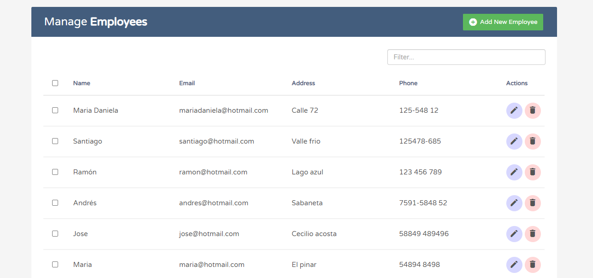
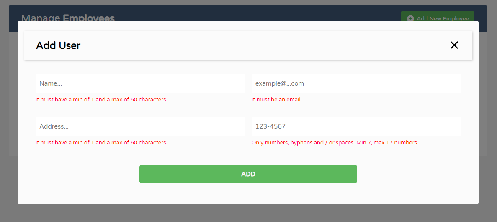
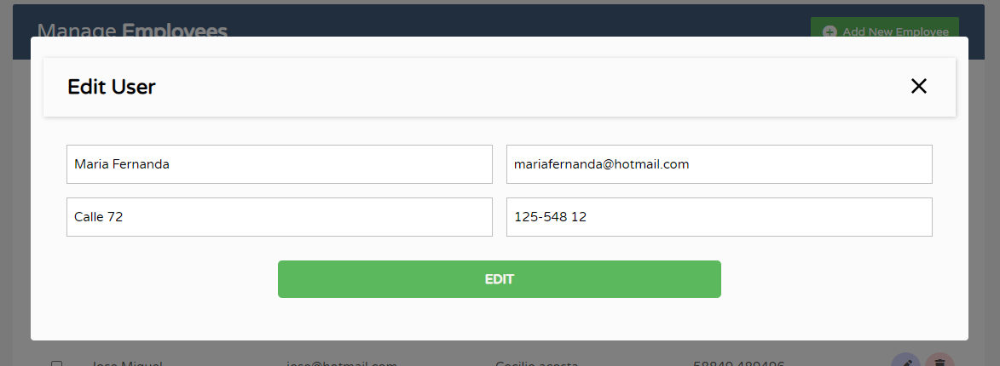
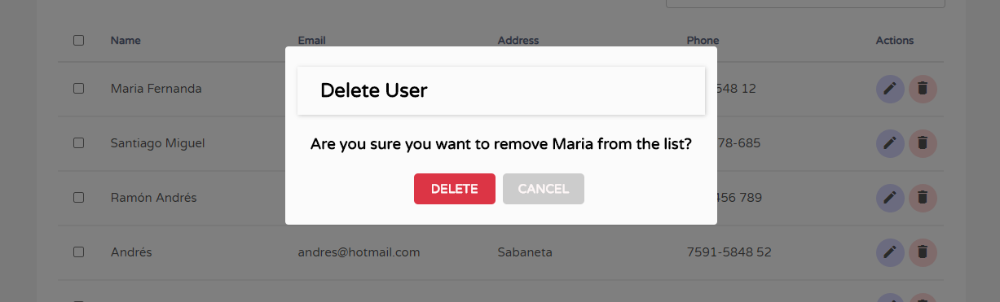

# Tp3-ada

3er trabajo práctico ADA 2020 (Js-DOM/Axios) Realizado por:

- Carla Fioroni
- María Alarcón
- Florencia Apreda
- Julieta Jaureguiberri

### Homepage

### Modal para agregar nuevos usuarios / formulario con validaciones

### Modal para editar usuarios

### Modal para borrar usuarios

